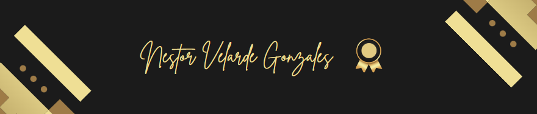

    

<h1 align="center">Hi , 
I am Néstor Velarde </h1>
<h3 align="center">Software Engineering Student | Programming </h3>

  <em>
    Hello 🙋, I am Néstor Velarde, <b>Sixth cycle</b> student at the <b>Peruvian University of Applied Sciences</b>, 
    a passionate self-taught programmer, obsessed
    with <b>development</b> and always seeking to find hidden patterns in development.
       
    <b><i align="center">Thought👀 :     
     "The code is poetry"</i></b> </b>  </b>
  </em>
  

## 👨🏻‍💻 &nbsp;About Me

- 📝 I am currently a student at <a href="https://www.upc.edu.pe/" target="_blank">Peruvian University of Applied Sciences</a>

- 🌱 I am currently learning new software development tools

- 💬 Ask me about **Angular, Vue and React**

- 📫 How to reach me **u20211c221@gmail.com**

- 📄 Get to know a little more about me, <a href="https://github.com/VelardeSoft/VelardeSoft/raw/main/img/CV-Software.pdf" target="_blank">Curriculum Vitae</a>

 

    

